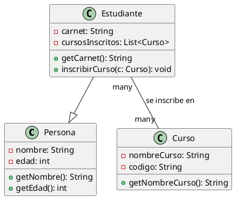

# Ejercicio 13 — Diagrama de Clases: Sistema de Estudiantes

```plantuml
@startuml
class Persona {
    - nombre: String
    - edad: int
    + getNombre(): String
    + getEdad(): int
}

class Estudiante {
    - carnet: String
    - cursosInscritos: List<Curso>
    + getCarnet(): String
    + inscribirCurso(c: Curso): void
}

class Curso {
    - nombreCurso: String
    - codigo: String
    + getNombreCurso(): String
}

Estudiante --|> Persona
Estudiante "many" -- "many" Curso : se inscribe en
@enduml
```