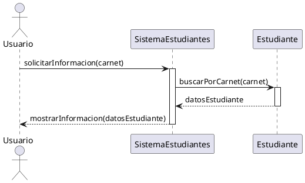

# Ejercicio 14 — Diagrama de Secuencia: Consulta de Información de Estudiante

```plantuml
@startuml
actor Usuario
participant SistemaEstudiantes
participant Estudiante

Usuario -> SistemaEstudiantes: solicitarInformacion(carnet)
activate SistemaEstudiantes

SistemaEstudiantes -> Estudiante: buscarPorCarnet(carnet)
activate Estudiante

Estudiante --> SistemaEstudiantes: datosEstudiante
deactivate Estudiante

SistemaEstudiantes --> Usuario: mostrarInformacion(datosEstudiante)
deactivate SistemaEstudiantes
@enduml
```